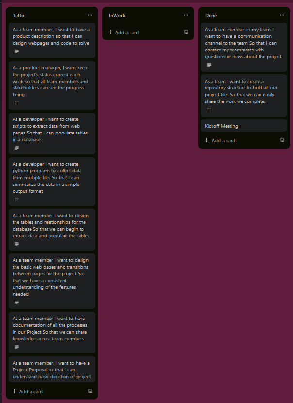

Template
------------
Document Title: YYYYMMDD Weekly Start WEEKLY LOG 
Week Start: YYYYMMDD 
Week End: YYYYMMDD 
Semester Week : # 
Image: 
<figure width=100%>
    
</figure>
Additional Comments: 

--------------------

Example:
-----------------------

Week Start: 20240204 
Week End: 20240211 
Semester Week : #8 
Image: 
<figure width=100%>
    
</figure>
Additional Comments: 
    -Lab 3 Acceptance Criteria Completed 
    -Brainstorming Session 
    -Reviewed Tasking and separated down 

-----------------------------
Week Start: 20240205  
Week End: 20240211 
Semester Week : #5 
Image: 
<figure width=100%>
    
</figure>
Additional Comments: 
    --Lab 3 Acceptance Criteria Completed 
    --Brainstorming Session 
    -- 

