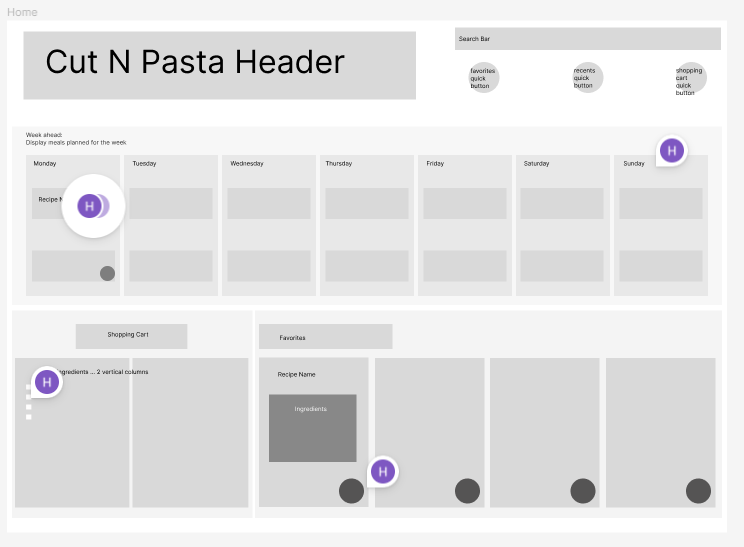

Home Page
----------------------
Page Description: This page will be the home page for CutNPasta where the user can navigate to the subpages. It displays information such as up to 4 recipes favorited by the user, a snapshot of the recipe plan for the week with the recipe titles, and a snapshot of the current items in the shopping cart. Clicking on these objects redirect the user to the page corresponding to the snapshot. Additionally, the home page includes a search bar that allows users to search the recipe database for a recipe with a given name, and buttons that redirect the user to the favorites page, recents page, and shopping cart page.
<figure width=100%>
    
</figure>

-----------------------
Parameters needed for the page:  
Page Title 
Containers for Weekly snapshot, favorites, shopping cart 
ingredients in shopping cart 
buttons for favorites, recents, shopping cart, weekly snapshot 
href links to redirect the user to the corresponding page 
input forms for user to use search bar 

----------------------
Data needed to render the page: 
Weekly snapshot: 
    Recipe name 
    Day of week selection  
Favorites: 
    Recipe name 
    Selection of favorite or not \~this sounds weird??? How do I say this??~ 
    image 
    ingredients 
Shopping cart: 
    Ingredients 
    Quantity of ingredient 
    
-----------------------
Link destinations for the page:  
Link destinations include \<a href> links to the shopping cart page, weekly plan page, favorites page, recents page, and recipe page specified by an input in the search bar.
    
------------------------
List of tests for verifying the rendering of the page 
    The search bar appears in the top right and takes in user input 
    Entering user input into the search bar redirects the user to the corresponding recipe page 
    Clicking on a container or button for weekly snapshot directs the user to the weekly plan page 
    Clicking on a container or button for favorites directs the user to the favorites page 
    Clicking on a container or button for for recents directs the user to the recents page 
    Clicking on a container or button for for shopping cart directs the user to the shopping cart page 
    Ingredients in the shopping cart are displayed with the correct quantity for all recipes added to the shopping cart 
    
    
 
