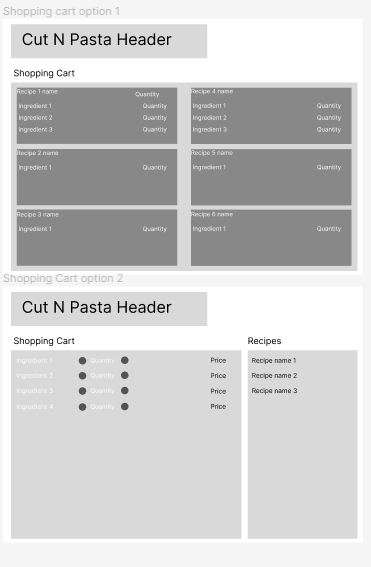
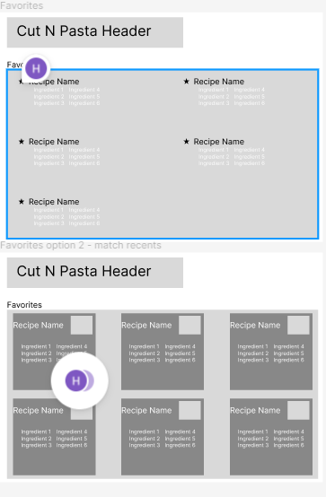
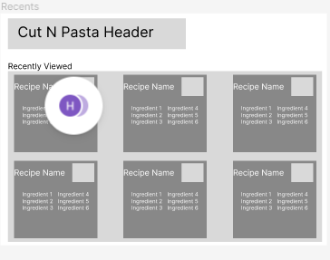
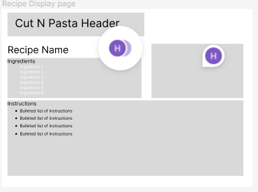
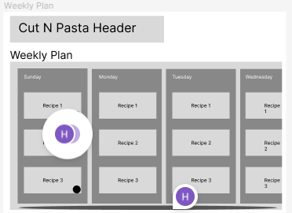

Home Page
----------------------
Page Description: This page will be the home page for CutNPasta where the user can navigate to the subpages. It displays information such as up to 4 recipes favorited by the user, a snapshot of the recipe plan for the week with the recipe titles, and a snapshot of the current items in the shopping cart. Clicking on these objects redirect the user to the page corresponding to the snapshot. Additionally, the home page includes a search bar that allows users to search the recipe database for a recipe with a given name, and buttons that redirect the user to the favorites page, recents page, and shopping cart page.
<figure width=100%>
    
</figure>

-----------------------
Parameters needed for the page:  
Page Title 
Containers for Weekly snapshot, favorites, shopping cart 
ingredients in shopping cart 
buttons for favorites, recents, shopping cart, weekly snapshot 
href links to redirect the user to the corresponding page 
input forms for user to use search bar 

----------------------
Data needed to render the page: 
Weekly snapshot: 
    Recipe name 
    Day of week selection  
Favorites: 
    Recipe name 
    Selection of favorite or not \~this sounds weird??? How do I say this??~ 
    image 
    ingredients 
Shopping cart: 
    Ingredients 
    Quantity of ingredient 
    
-----------------------
Link destinations for the page:  
Link destinations include \<a href> links to the shopping cart page, weekly plan page, favorites page, recents page, and recipe page specified by an input in the search bar.
    
------------------------
List of tests for verifying the rendering of the page 
    The search bar appears in the top right and takes in user input 
    Entering user input into the search bar redirects the user to the corresponding recipe page 
    Clicking on a container or button for weekly snapshot directs the user to the weekly plan page 
    Clicking on a container or button for favorites directs the user to the favorites page 
    Clicking on a container or button for for recents directs the user to the recents page 
    Clicking on a container or button for for shopping cart directs the user to the shopping cart page 
    Ingredients in the shopping cart are displayed with the correct quantity for all recipes added to the shopping cart 
    
    
Shopping Cart
----------------------
Page Description: This page displays all of the ingredients currently in the shopping cart. When the user adds recipes to the shopping cart, like ingredients are aggregated and the total quantity of each ingredient is displayed. There are buttons for the user to add or remove from the quantity of each ingredient. There is a list of the recipe names that were added to the shopping cart. The user can deselect a recipe to remove all of the associated ingredients from the shopping cart. If there are redundant ingredients, only the quantity required for the removed recipe are removed from the shopping cart.
<figure width=100%>
    
</figure>
-----------------------
Parameters needed for the page:
----------------------
Data needed to render the page:
-----------------------
Link destinations for the page: Links are used to redirect the user to the recipe page of a recipe when the name of the recipe is clicked on.

------------------------
List of tests for verifying the rendering of the page: 
Recipe names include links to the recipe page of the recipe on click 
Clicking add or remove from quantity adds or removes the quantity of the ingredient by 1 
clicking remove a recipe name removes only the quantity of each ingredient needed for the recipe from the shopping cart 
If an ingredient is needed in multiple recipes, the ingredient name only appears once in shopping cart with the quantity of the ingredient for all the recipes displayed 

Favorites
----------------------
Page Description (include a mockup or hand drawn image of the page):  
Displays the recipes, recipe image, and ingredients for recipes that have been marked as favorite by the user.
<figure width=100%>
    
</figure>
-----------------------
Parameters needed for the page
----------------------
Data needed to render the page
-----------------------
Link destinations for the page
------------------------
List of tests for verifying the rendering of the page

Recents
----------------------
Page Description (include a mockup or hand drawn image of the page): 
Displays recipe name, recipe image, and ingredients for recipes' whose pages were recently visited by the user.
<figure width=100%>
    
</figure>
-----------------------
Parameters needed for the page
----------------------
Data needed to render the page
-----------------------
Link destinations for the page
------------------------
List of tests for verifying the rendering of the page

Recipe Display
----------------------
Page Description (include a mockup or hand drawn image of the page): 
Displays recipe name, recipe image, ingredients, and instructions for the recipe. Buttons allow users to add the recipe to favorites, shopping cart, and/or weekly plan. When the button for weekly plan is clicked, a pop up menu allows the user to select the day of week and meal (breakfast, lunch, or dinner) to add the recipe to.
<figure width=100%>
    
</figure>
-----------------------
Parameters needed for the page
----------------------
Data needed to render the page
-----------------------
Link destinations for the page
------------------------
List of tests for verifying the rendering of the page

Weekly Plan
----------------------
Page Description (include a mockup or hand drawn image of the page): 
The weekly plan displays a weekly calendar with the recipe selection for each day and meal (breakfast, lunch, and dinner). A button can be clicked to add all ingredients from the recipe to the shopping cart.
<figure width=100%>
    
</figure>
-----------------------
Parameters needed for the page
----------------------
Data needed to render the page
-----------------------
Link destinations for the page
------------------------
List of tests for verifying the rendering of the page

